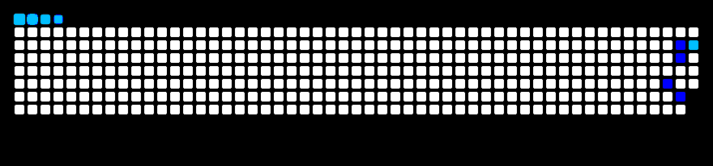

# Olá 👋, eu sou Marlon

**Estudante de Ciência da Computação 2/10**  
Brasil

Atualmente estou cursando **Ciência da Computação**, construindo uma base sólida em **programação, algoritmos e desenvolvimento de software**.

Meu foco atual está em **C, C++, lógica de programação, algoritmos e resolução de problemas**, utilizando projetos práticos para transformar conhecimento em experiência.

Sou apaixonado por tecnologia e desenvolvimento de software, e estou sempre buscando **aprender, praticar e evoluir**.

---

## 🌐 Onde me encontrar

  
  
  
  

---

## 🧠 No que estou focado

- 💻 Programação em C e C++
- 🧠 Lógica de programação
- 🧩 Algoritmos e resolução de problemas
- 📚 Fundamentos da Ciência da Computação
- 🚀 Desenvolvimento de projetos pessoais e acadêmicos
- 📈 Evolução constante das minhas habilidades

---

### Linguagens

---

### 📚 Atualmente estudando

- 🧠 Lógica de Programação
- ⚙️ Algoritmos
- 🧩 Estruturas de Dados
- 🔢 Pensamento Computacional
- 🏗️ Fundamentos de Desenvolvimento de Software
- 💻 Programação em C e C++

---

## 🚀 Últimos Projetos

### 📊 Jogo da Velha

Projeto acadêmico desenvolvido em **C++** para aplicar conceitos de lógica de programação, estruturas condicionais e manipulação de matrizes.
🔗 [Ver projeto no GitHub](https://github.com/marlon-dsv/jogo-da-velha.cpp)

---

### 🎓 Sistema de Bolsa Universitária

Projeto desenvolvido em **C++** para simular um sistema de avaliação de bolsas universitárias utilizando diferentes critérios acadêmicos e socioeconômicos.
🔗 [Ver projeto no GitHub](https://github.com/marlon-dsv/sistema-de-bolsa-universitaria)

---

## 🎯 Objetivos

- 🚀 Me tornar um excelente desenvolvedor de software
- 🧠 Dominar algoritmos e estruturas de dados
- 💻 Aprender novas linguagens de programação
- 🏗️ Desenvolver projetos cada vez mais completos
- 🤝 Contribuir com projetos de código aberto
- 📚 Evoluir constantemente meus conhecimentos técnicos
- 💼 Construir uma carreira sólida na área de tecnologia

---
## 📊 Estatísticas do GitHub

  
  

## 🐍 Minhas contribuições

  

## 🚀 Filosofia

> _"Não busco apenas escrever código. Busco entender problemas, encontrar soluções e evoluir a cada projeto."_

---

⭐ Se você gostou dos meus projetos, considere deixar uma estrela!

🤝 Estou sempre aberto a aprender, colaborar e conhecer novas pessoas da área de tecnologia.

